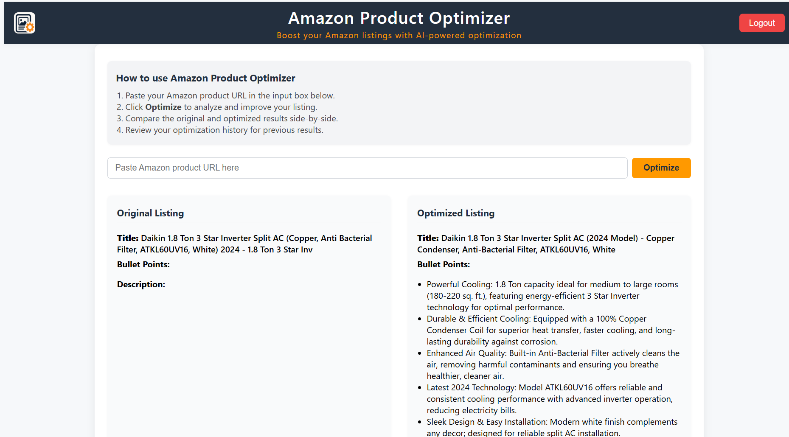
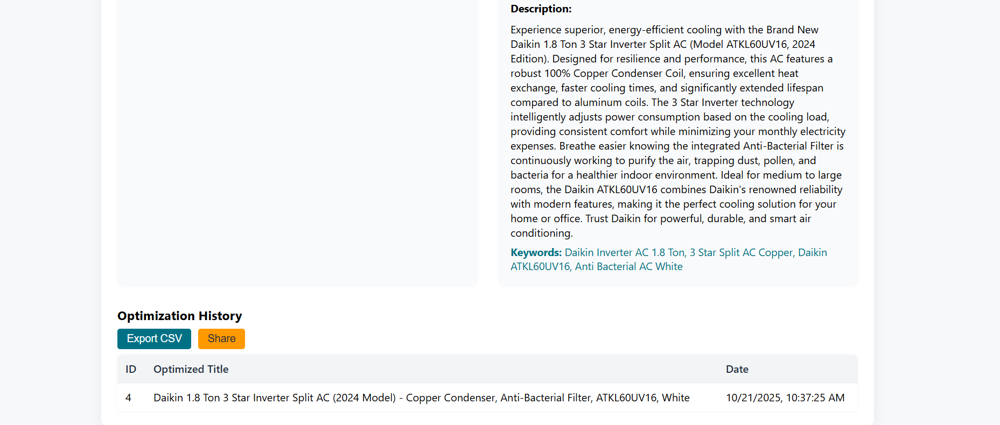

# Amazon Product Optimizer

## 🚀 Live Demo
[Public App URL](https://amazon-frontend-asin-optimizer.onrender.com/)

## Project Overview
This repository contains a full-stack application for optimizing Amazon product listings using AI. The system allows users to input a product URL, fetches the corresponding product details, and generates optimized content (title, bullet points, description, and keywords) using an AI model (OpenAI or Gemini). The application stores both the original and optimized listings, provides a side-by-side comparison, and maintains a history of all optimizations for each ASIN.

## Architecture
- **Backend:** Node.js, TypeScript, Express, Prisma ORM (MySQL)
- **Frontend:** React, TypeScript, Vite
- **AI Integration:** OpenAI (default) or Gemini (configurable)
- **Product Data API:** Rainforest API (recommended), Keepa, or Amazon PA-API
- **DevOps:** Docker Compose for local development and deployment

## Features
- Fetch Amazon product details by ASIN
- Optimize listing content using AI
- Store and compare original and optimized listings
- Track optimization history for each ASIN
- Modern, user-friendly web interface

## Setup Instructions

### 1. Clone the Repository
```sh
git clone https://github.com/kumarBisho/Amazon-Product-Optimizer.git
cd Amazon-ASIN-Optimizer
```

### 2. Environment Variables
Copy the example environment files and fill in your credentials:

- Backend: `cp backend/.env.example backend/.env`
- Frontend: `cp frontend/.env.example frontend/.env`

Edit the `.env` files to set your database credentials, API keys, and AI model preferences.

### 3. Database Setup
Create a MySQL database (default: `salesduo`). Example using MySQL CLI:
```sh
mysql -u root -p
CREATE DATABASE optimization;
EXIT;
```

### 4. Backend Setup
```sh
cd backend
npm install
npx prisma generate
npx prisma migrate dev --name init
npm run dev
```
The backend will start on port 4000 by default.

### 5. Frontend Setup
```sh
cd ../frontend
npm install
npm run dev
```
The frontend will start on port 5173 by default.

### 6. Docker Compose (Optional)
To run the entire stack (database, backend, frontend) with Docker Compose:
```sh
docker-compose up --build
```
This will launch MySQL, the backend, and the frontend in containers.

## Project Structure
- `backend/` — Express API, Prisma ORM, AI integration
- `frontend/` — React UI, Vite config
- `docker-compose.yml` — Multi-service orchestration
- `.env.example` — Example environment files for configuration

## User Interface

### Input UI
<p align="center">
	
</p>

### Output UI
<p align="center">
	
</p>
<p align="center">
	
</p>

## Expected Outcomes
- Efficiently optimize Amazon product listings using state-of-the-art AI
- View and compare original vs. optimized content for each ASIN
- Track and audit the history of all optimizations performed
- Ready for deployment on cloud platforms or local development

## Deployment
Push your repository to GitHub. You can deploy the backend on platforms like Render, Railway, or your own server, and the frontend on Vercel, Netlify, or similar services. Ensure environment variables are set appropriately in your deployment environment.

---
For further details, see the `backend/README.md` and `frontend/README.md` files.
